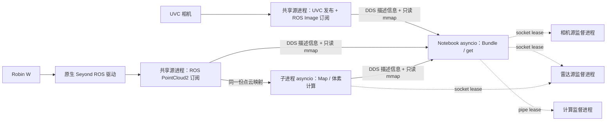

# 设计与取舍

## 运行结构

`Sensor` 表示数据与生命周期，`Runtime` 负责拥有关系。`Bundle`、`Map` 是普通 Sensor，没有特殊运行后端。`ProcessSensor(factory)` 将工厂创建的整棵图放到子进程；内部同样使用 Runtime，可以再次包含 ProcessSensor 或 SharedSensor。

`Reference(target)` 不拥有目标，不递归启动目标；用于同一 Runtime 内的反向/共享引用。拥有关系的环与数据反馈环分开处理：前者拒绝，后者必须由业务处理初始值、超时和时序。

## asyncio 与 ROS 执行器

每个 Runtime 的 ROS 节点共用一个 `RosContext`，以限速协程调用 `SingleThreadedExecutor.spin_once(timeout_sec=0)`。ROS 回调只做短入队；消息转换、发布帧、用户处理通过 Sensor.task 调度。队列和历史均有界。

两种调度器的 Future/等待机制不同，因此原型采用明确的轮询桥接，便于控制频率并在 Notebook 已有事件循环中运行。实现参考 [rclpy 执行器源码](https://github.com/ros2/rclpy/blob/jazzy/rclpy/rclpy/executors.py)；该链接固定到设计参考版本，使用其他版本时需核对接口兼容性。

`get` 本身是事件驱动的协程：调用者等待 Condition，发布端通知；任务速率由生产、转换、DDS 轮询和用户服务各自的 Metronome 控制。重计算通过 ProcessSensor 隔离，不依赖 Python 线程获得 CPU 并行。

## DDS 与共享内存

ROS 2 常规 Python Image/PointCloud2 发布不能直接等同于 loan。Fast DDS 的 [Data Sharing](https://fast-dds.docs.eprosima.com/en/stable/fastdds/transport/datasharing.html) 还有类型、内存与端点配置条件；[ROS loan 设计](https://github.com/ros2/design/blob/gh-pages/articles/zero_copy.md) 涉及中间件及客户端支持。本原型使用以下混合通道：

- ROS/DDS String topic 发布小型、JSON 编码的帧描述信息，可靠且 transient-local，支持发现后读取最新帧。
- 数组使用 `/dev/shm` 中的 `.npy` 文件，保留 dtype、shape 和结构化点记录；读者 `np.load(..., mmap_mode="r")`。
- 文件路径含独立帧代号，不重复写入旧文件。读者验证路径在该源目录下，再打开只读映射。
- 已共享的完整 memmap 跨层转发使用硬链接；`allocate` 允许计算直接写入共享输出，提交时不再复制 payload。
- 历史淘汰 unlink 文件，不覆写任何有效映射。文件页由内核按实际映射生命周期回收。

这里的零拷贝边界是同机数据平面的数组映射共享，不包括远程传输、rclpy 消息转换、ROS 驱动内部或原生 Fast DDS loan。体素计算示例中 `np.unique` 的返回数组首次共享需要复制；距离数组则直接在 `allocate` 输出中计算。

`/dev/shm` 是传输实现使用的临时运行时存储，不是实验资产目录。需要保存的图像、图表、采集结果、日志和报告统一写入项目根目录的 `assets/`，约定见 [开发说明](development.md)。

## 所有权和失败处理

| 场景 | 行为 |
|---|---|
| 正常退出 / Notebook 异常 / Task 取消 | Runtime 逆序取消任务、唤醒等待者并调用 close |
| Sensor 任务异常 | WatchDog 保存原因、取消同节点任务、通知 get/service；上层 WatchDog 传播错误 |
| 普通子进程主循环卡死 | 独立监督进程仍可处理父端 pipe EOF；SIGTERM 后最多等待 5 秒，再 SIGKILL |
| 主进程被 SIGKILL | 内核关闭 lease FD；各层监督进程递归停止 worker 并清理共享文件 |
| 共享源第一个客户离开/被杀 | 其他 Unix socket lease 保持采集存活 |
| 共享源最后一个客户离开 | 监督进程在选举锁下关闭监听、停止 worker、删除帧文件 |
| 不同客户同时创建同一源 | 文件锁串行化创建/连接；共享一个 source worker 和 DDS 描述信息 topic |
| 同一源 key 配置不同 | 拒绝连接，避免悄悄复用不同参数的设备 |
| 不同 DDS domain 请求同一物理设备 | 独立的物理设备锁拒绝第二次硬件启动；使用者应统一 domain |

原生驱动使用 Linux `PR_SET_PDEATHSIG`，避免 Python 采集进程突然消失后留下驱动。监督进程独立于计算进程；不能用同一条被计算阻塞的 asyncio 循环来保障其自身退出。

共享源面向同机、同 Unix 用户的可信库使用者；未接入本库的第三方驱动不会遵守其锁协议。默认不修改用户 ROS 工作空间、网络配置、设备时间同步或标定参数。

## 后续可以继续演进

固定大小的 C++ loan 类型/原生 DDS Data Sharing、跨机器 fallback、跨进程自定义 service RPC、硬件时钟同步和深度相机标定是后续扩展方向。当前交付是需求测试用基础原型，公开 get/组合接口可保留，后端可以替换。

硬件协议参考：[Seyond 官方 ROS 驱动](https://github.com/Seyond-Inc/seyond_ros_driver)、[RealSense 官方 ROS 驱动](https://github.com/realsenseai/realsense-ros)。部署时应按实际设备型号、固件及驱动版本验证参数和消息格式。
