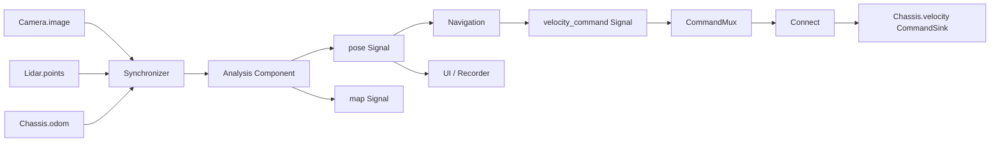

# Component / Signal 架构

代码按 `core`、`runtime`、`transport`、`adapters`、`devices`、`drivers`、`components` 和 `config` 分包。模块职责、依赖方向、扩展方式及导入迁移见 [包结构与扩展](modules.md)；本文描述运行时模型和数据语义。

## 两张独立的图

`Component` 是生命周期和计算单位，`Signal[T]` 是由组件产生的时间序列。Signal 没有 open/close、WatchDog 或自己的进程。Component 可以有零个、一个或多个输出；数据存储和 `get()` 不再放进通用 Component。



生命周期由 `Component.dependencies` 描述，必须是 DAG；同一个对象或相同 key/configuration 的源仅打开一次。`Component.inputs` 是数据边，Runtime 从每条 Signal 的 producer 反向发现组件；数据图可以有反馈环。反馈仍需要业务提供初值或延迟，框架不制造首帧。启动顺序始终满足 ownership 依赖，数据输入只提供启动顺序偏好；所有组件的端口在 open 阶段前进入运行状态，允许 seed publication。

`Runtime(component.output)` 与 `Runtime(component)` 都管理所需的运行图。关闭时逆序停止任务、执行 sink 安全状态、关闭资源并唤醒等待者；失败经 ownership 和数据依赖传播。Signal 别名共享实际 Frame 缓冲，同时保留公开组件的失败语义。

## 核心接口

| 类型 | 责任 | 接口 |
| --- | --- | --- |
| Component | 所有权、任务、失败、放置位置 | dependencies / inputs / open / close / task / service / wait / expose |
| Signal[T] | producer、历史、时间查询、广播等待 | publish / get / frames |
| Frame[T] | 数据及其时间元信息 | data / stamp_ns / clock / received_ns / sequence / sample_id / metadata |
| PrimaryComponent | 明确的单输出便捷接口 | output / primary / get / publish |
| CommandSink[T] | provider 所有的写端口 | set |
| Runtime | 解析两张图并绑定部署位置 | async with / wait |

`Frame` 不可变，但 payload 的不可变性是发布协议：发布后不得再修改数据或保留写别名。同进程不自动复制数组，也不自动设置数组 writeable 标记。跨进程读者得到只读 OS 映射。

`Signal.get()` 读取最新帧；`after` 是当前端口的本地观察游标。跨边界会生成本地 sequence，不能用两个端口的 sequence 相等推断同一次物理采样。时间查询要求显式 clock，使用最近邻容差，历史外抛出 `HistoryMiss`。`received_ns` 是 Unix 接收/产生时间，会随派生组件是否显式继承而不同；它不证明设备时钟同步。

`SampleId` 区分 producer 实例、canonical port 与该实例的发布序号；新边界协议保持该身份，Frame.sequence 仍是本地游标。重新打开 producer 创建新实例；动态导出保留样本不修改原 Frame，也不增加源发布次数。`metadata` 可携带业务版本关联信息。

多输出组件（底盘、SLAM、Navigation）直接暴露命名 Signals，不提供模糊的聚合 get。只有明确 primary output 的组件提供 get 快捷调用。自定义算法可以保持内部变量，只将需观察、复用或传输的结果声明为 Signal。

## 组合与时钟

`Map(signal, function)` 产生 `.output`；未返回新 Frame 时继承输入时间元信息。`Bundle(**signals)` 是各路 latest snapshot，保留每路时钟，自己的 Frame 用主机 Unix 时间。

```python
from rsim import Synchronizer, ClockTransform

sync = Synchronizer(
    image=camera.image, odom=chassis.odom,
    reference="image", clock="robot", tolerance_ns=20_000_000,
    transforms={"image": camera_to_robot, "odom": odom_to_robot},
    interpolate={"odom": interpolate_odometry},
)
```

`ClockDomain(name)` 明确时间域；`ClockTransform(source, target, offset_ns, rate)` 做显式仿射换算，rate 可用 Fraction 避免大整数时间戳的浮点精度损失。标定参数及不确定性由应用提供，框架不从字符串名称猜测相同时间域，也不自动同步硬件时钟。

`Synchronizer` / `TimeJoin` 围绕每个参考帧的目标时间选取其他输入中当前保留的最近样本。插值函数接收 `(left.data, right.data, fraction)`，必须有双侧 bracket，两端都在容差内；不外推。输出 data 为 `name -> Frame`：原始样本保留其时钟和对象引用，插值 Frame 使用目标时钟与 sequence=0 表示派生结果。

`join(timestamp_ns, clock=...)` 可直接查询；没有匹配样本时最多等 wait_timeout，然后抛 HistoryMiss。后台同步任务丢弃这次未匹配的参考帧并计入 dropped；时钟不匹配属于配置错误，会使组件失败。它是有界实时 join，不是等待所有未来样本后求全局最优配对。

## 控制接口与所有权

`VelocityCommand(linear_x, angular_z)` 为平面速度模型。控制器只发布命令 Signal；`Connect(source, sink)` 负责转发。原始值由 Connect 封装为命令，已有 CommandEnvelope 则保留其身份和 deadline，不因转发而续期。控制输出可以同时被 Recorder/UI 读取，不重复运行控制器。

`CommandMux` / `Arbiter` 按显式优先级选择有效输入，相同优先级按声明顺序。输入为 `CommandInput(signal, priority, timeout)`；缓存数据的有效期不因重复仲裁而更新。`override(name)` 独占选择指定来源，该来源过期时使用 fallback；`override(None)` 恢复优先级选择。

Runtime 拒绝同一 sink 的两个 Connect。被 Connect 占有的 sink 拒绝旁路直接 set。不同会话的竞争还由 provider 的独占租约检查处理；DDS 到达顺序不充当仲裁规则。

`CommandEnvelope` 包含 value、controller_id、controller_epoch、sequence、deadline_ns。最终 provider 拒绝过期、超出最大 TTL、重复/倒序 sequence、已退役 epoch，以及当前租约内的其他 controller。epoch 变更不能抢占仍有效的控制器；过期后更换会话，旧 epoch 被永久退役到该 provider 生命周期结束。过期或关闭执行 fallback，反馈应作为单独 Signal。Connect 将已过期命令计入 dropped 并继续等待新命令；身份冲突、无效命令或真正的组件故障仍会报错。

同机 deadline 使用共享的 CLOCK_MONOTONIC 纳秒。跨主机必须由 adapter 转换，不能直接比较两台机器的 monotonic 值。ROS1 adapter 使用握手/心跳估计保守 offset，网络延迟消耗有效期；远端再次限制最大 0.5 秒，并在线程 WatchDog 中发布零速。该机制不是电机执行确认，硬件驱动/固件的最终制动保障仍需独立验证。

通用 CommandSink 的 deadman 是 provider 的 metered task，不能抢占同一循环的阻塞计算。因此应将计算组件与实际执行器 provider 隔离；底盘保护在远端兼容进程中执行，不依赖主机控制循环正常运行。

## Placement 与通道绑定

```python
from rsim import Runtime, ProcessPlacement, LocalPlacement

async with Runtime(analysis.pose, drive, placement={
    analysis: ProcessPlacement("perception"),
    navigation: ProcessPlacement("planning"),
    chassis: LocalPlacement(),
}):
    pose = await analysis.pose.get()
```

放置位置不改变逻辑接口。也可在 Component 构造时给 placement。相同进程名共享一个 worker；拥有关系中的未显式放置资源跟随 owner，数据输入默认保持独立位置。共享资源被不同 owner 要求放到不同位置时，需显式指定位置。一个 Runtime 的跨进程通道使用同一 DDS domain，可选原生或 ROS2 后端。RosContext / DescriptorTransport 标记为 process_local，各拥有进程建立自己的上下文；它们不承载 Signal 数据，也不会因上下文复制而重复硬件 producer。

| 边界 | 绑定 | 数据路径 |
| --- | --- | --- |
| 同一事件循环 | LocalReference | 同一个 Frame / payload 引用 |
| 同 host 跨进程 | DDSChannel / SharedMemoryChannel | DDS 描述信息 + SharedStore / mmap |
| 跨主机 ROS1 adapter | SSH topic 协议 | 序列化消息内容，主机解码 |

部署计划分别计算 ActiveComponents 与 DemandedPorts。Signal 根只请求自身，Component 根展开公开输出，inputs 精确请求输入端口；资源 dependencies 与显式 placement 不增加需求。CommandSink 根和 command targets 显式请求写端口。未绑定远端端口抛 `PortNotBound`，本地已启动的其他输出仍可读取。`Component.expose()` 建立公开别名并沿用真实 producer，不轮询或复制历史。

部署计划只在需要跨边界的输出安装 materialization。内部 Component/Signal 不自动产生共享文件；多输出组件仍只计算一次。一个共享 allocator 复用同一普通数组的首次发布，多个读者映射相同 inode，原路径仍存在的完整只读 memmap 转发使用硬链接。明确需要直接共享分配时可以使用 `allocate()`；现有工厂式 ProcessSensor 为其安装 worker store，普通本地分配保持 NumPy 数组。

Signal payload 支持标量、字典/列表/元组、NumPy 数组、Image、PointCloud，以及封闭 schema 的 Frame、SampleId、CommandEnvelope、VelocityCommand。安装可选 graphmap 依赖后，也支持以平移、四元数、尺度和坐标标签编码的 Pose，见 [位姿融合与底盘控制](motion.md)。任意 Python 对象可在本地传递，但不能未经适配直接跨该通道；描述信息不反序列化任意 Python 类。工厂/部署代码只通过 cloudpickle 在同一应用解释器内启动；不同 Python 版本应用通过 SharedComponent（或旧单输出 SharedSensor）连接 provider，不交换工厂。

跨进程 CommandSink 使用可靠、volatile 的请求/应答 topic。请求有去重 ID，payload 中的 envelope 在最终 provider 再次校验；通道先通过无执行副作用的握手确认发现；发现或应答延迟超过 deadline 的命令按过期丢弃，下一条新命令仍可继续，重试不改变 deadline。只导出端口，普通组件属性、设备句柄和 service 不变成远程 RPC。部署到其他进程后应只通过公开 Signals / CommandSinks 交互。

## 生命周期与物理共享边界

每个 worker 有独立的 lease supervisor。正常关闭、父端 EOF 或 SIGKILL 后，监督进程先 SIGTERM，超时再 SIGKILL，递归进程仍使用独立 lease。部署存储另有 guardian，处理父进程消失后的主机输入缓存和命令缓存回收。共享硬件 provider 仍使用同用户文件锁、Unix socket lease 和共享源监督进程，最后一个客户端退出才关闭。

DDS 端点由 DescriptorTransport 的限速任务轮询。ROS 输入在 RosContext 中轮询 SingleThreadedExecutor，回调短入队，转换由 Component task 调度。WatchDog 检查任务异常和依赖失败；它无法抢占同一进程内的阻塞代码。

DDS 只序列化 JSON 描述信息，数组不经过 DDS payload 序列化；ROS 驱动到 Python 的路径仍可能复制。这不等于 rclpy loan 或原生 DDS Data Sharing。每帧独立不可变文件，历史淘汰 unlink，不覆盖已有映射；慢读者可能跳过尚未映射且已被淘汰的帧。长期保留 Frame 的用户仍会持有相应内存页；若其文件路径已淘汰，之后再次导出只能重新写入数组，不能复用已经 unlink 的路径。

临时运行存储属于 adapter 实现；实验资产统一保存在根目录 assets/。底层源去重和物理锁面向同机同 Unix 用户的协作使用者，不约束不使用本库的第三方发布者。

## 从 Sensor 迁移

- 自定义纯资源类改继承 Component；删除无意义的 history/get。
- 单输出计算改继承 PrimaryComponent，使用 `.output`；旧 Sensor 仅为兼容基类。
- 数据输入从 `super().__init__(source)` 改为 `super().__init__(inputs=(source.output,))`。资源依赖仍放 dependencies，不再用 children 推断数据输入。
- Map.source 和 Bundle.sources 是 Signals；相机 `.image`、雷达 `.points`。底盘与 ROS2 镜像无聚合 get，需要快照时显式创建 Bundle。
- 优先用 Runtime placement 移动既有组件；ProcessSensor 仍支持旧单输出工厂及嵌套，SharedSensor 保留独立环境的共享源租约。
- ROS1 兼容协议升级为 v2，主机与远端脚本必须一起更新；v1 缺少 deadline/epoch 校验会被拒绝握手。

可运行的多输出、同图两种部署和模拟控制见 [components.py](../examples/components/components.py) 与 [Notebook](../examples/components/components.ipynb)。原需求说明保留在 [重构文档](重构文档.md)。

多环境多端口协议、按需端点与租约的使用方法见 [多端口共享](shared-components.md)；设计依据保留在 [重构文档 v2](重构文档v2.md)。
