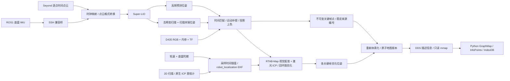

# 多传感器 RGB 建图

`rsim.drivers.Mapper` 将 Super-LIO 与 RTAB-Map 组装为共享 provider；`load_mapper()` 从 YAML 创建同一个组件。**几何来自 Super-LIO 去畸变后的激光点，D435 提供 RGB 上色及视觉特征，默认关闭深度流。** RTAB-Map 接收匹配的 RGB、激光点云和里程计，默认将激光投影为视觉特征深度，以视觉匹配和激光 ICP 验证回环，再优化关键帧位姿。可选独立 EKF 融合轮速、底盘陀螺和二维扫描位姿，作为 RTAB 的局部里程计；不将这些约束塞入 Super-LIO。该组件只读设备，不创建速度写端。

## 数据流与接口



| 端口 / 方法 | 数据与含义 |
| --- | --- |
| `await mapper.pose.get()` | `Frame[graphmap.pose.Pose]`；`T_map_base_footprint`，包含 RTAB-Map 全局修正 |
| `await mapper.odometry.get()` | 局部 `T_odom_base_footprint`；启用融合时来自独立 EKF，否则来自 Super-LIO。其采样时刻可滞后墙钟 |
| `await mapper.rgb_map.get()` | `Frame[PointCloud]`；`x/y/z: float32`、`r/g/b/color_valid: uint8`，单位米。未上色点保留激光几何，以灰色显示且 `color_valid=0` |
| `await mapper.map.get()` | 一致版本的地图字典，含 InfoPoints 数组、体素键、稳定来源编号与来源关系；见下文 |
| `await mapper.status.get()` | 接入计数、时间偏移、输入年龄、配对误差、关键帧/回环计数、地图版本及配置假设 |
| `await mapper.save(path, frame=None)` | 导出最新或指定 `rgb_map` Frame 为 binary little-endian `.ply`；仅含 XYZ/RGB，不保留完整索引 |

端口均支持 `get(after=frame.sequence)` 和 `get(timestamp_ns=..., clock=...)`；历史由 `history` 限定。默认只保留少量帧，历史查询应在保留窗口内完成。没有默认的 `mapper.get()`。

```python
import asyncio
from rsim import Runtime, load_mapper, GraphMap

mapper = load_mapper(config_path)
async with Runtime(mapper):
    pose_frame = await mapper.pose.get(timeout=60)
    same = await mapper.pose.get(timestamp_ns=pose_frame.stamp_ns, clock=pose_frame.clock)
    pose = pose_frame.data
    cloud = (await mapper.rgb_map.get(timeout=30)).data
    view = GraphMap().update((await mapper.map.get(timeout=30)).data)
    await asyncio.to_thread(view.save, graphmap_directory)
    await mapper.save(output_path)  # .ply
```

在另一个进程或无 ROS 的 Python 环境中连接同名 provider：

```python
from rsim import Runtime
from rsim.devices import Mapper

mapper = Mapper("mapping")
async with Runtime(mapper):
    pose = (await mapper.pose.get(timeout=60)).data
    points = (await mapper.rgb_map.get(timeout=30)).data.points
```

客户端需要 RSim、DDS 与 graphmap；无需 ROS、相机或雷达 SDK。`load_mapper(config_path, providers=False)` 也只连接，读取配置中的 `name/history/transport`。provider 内部协程、原生 C++ 子进程由 Runtime/WatchDog 管理；多个客户端共享一个 provider。所有客户端离开后释放资源。

默认不启用二维扫描与独立融合；设置 `scan2d_parameters: {}` 和 `fusion_parameters: {}` 可启用，并需提供 `body_scan` 安装 Pose。相机视野外、背面或遮挡测试未通过的点仍保留几何，但没有有效颜色。

## 稳定来源、体素与特征

`source_id = (RTAB-Map node_id << 32) | local_row` 是 uint64，完整身份为 `(session_id, source_id)`。它标识一次激光观测，不宣称跨关键帧的同一物理表面已有唯一编号。关键帧局部点和行号固定，优化只替换 `T_map_base_at_RGB`。不可将 ID 填入 float32 或 InfoPoints 的 legacy index 列；该列保持零。

graphmap `point_key` 由当前 XYZ 和体素分辨率计算，沿用 `point_keys_from_xyz` 的舍入与范围规则。它是位置索引，会随回环变化。每次发布同时提供：

| 字段 | 含义 |
| --- | --- |
| `session_id / revision / resolution / frame_id` | 会话、单调版本、体素尺寸与坐标系 |
| `infopoints` | Nx6 float32，直接交给 `graphmap.InfoPoints`，几何代表为真实激光点 |
| `point_keys / representative_ids` | 每个输出体素的键与代表观测 ID，均为 uint64 |
| `source_ids / source_keys` | 按来源 ID 排序的全部有效观测及其当前体素键，包含被体素合并的观测 |
| `source_stamps_ns / source_pixels` | RGB 原始时间戳与 raw RGB 的行/列；未上色为 `[-1,-1]` |
| `keyframes` | 关键帧位姿、原始里程计、扫描/RGB 时间戳及相机标定信息 |

InfoPoints 时间列为相对 `epoch_ns` 的 int32 毫秒；绝对时间保存在来源数组中。每个体素优先选择有颜色的观测，其次选择较新观测；来源关系不会因选择代表点而丢失。跨关键帧的点碰巧进入同一体素不等价于物理身份融合。

`GraphMap` 是应用持有的视图和特征仓库。它不启动驱动；调用 `update()` 接收新地图后保留来源特征，重新派生体素表：

```python
view = GraphMap()
frame = await mapper.map.get(timeout=60)
view.update(frame.data)
source_id = int(view.source_ids[0])
view.set_features("semantic", [source_id], [{"label": "wall"}])

# 放入应用的异步任务中，持续跟随新的图优化结果。
frame = await mapper.map.get(after=frame.sequence)
view.update(frame.data)
key = view.voxel_for(source_id)
contributors = view.sources_for(key)
records = view.index_db("semantic").get(key)
env = view.environment()  # graphmap.Environment / InfoPoints / IndexDB
```

`feature_dbs[name]` 是以来源 ID 为键的 IndexDB；`index_db(name)` 则以当前体素键查询，值为 `{source_id, value}` 记录列表。体素合并时保留所有记录，拆分时各自跟随来源，调用方可自行选择语义投票/特征聚合规则。`index_db("sources")` 保存体素到全部来源 ID，`index_db("representative")` 保存代表 ID；直接查询来源关系使用紧凑数组，避免每次发布都构建大量 Python 索引对象。

已有体素特征可以调用 `set_voxel_features(name, keys, values, revision=view.revision)`，将值绑定到当时的全部来源点；过期版本会拒绝。新加入该体素的观测不会自动继承旧特征。不要直接修改派生体素表来保存持久特征。

GraphMap 是应用侧可变对象，`update`、特征写入和保存应由同一任务串行调度；使用 `asyncio.to_thread(view.save, ...)` 时，等待保存完成后再修改该视图。不同应用可持有各自的特征表，共享同一 provider 的只读几何数组。

优化按**各关键帧的位姿**重算 XYZ、体素和归属，不仅整体应用一次 map→odom。旧体素消失后不留下孤立特征。实时 RTAB-Map 部分图缺少某个节点不表示删除；默认保留所有工作记忆。组件要求 `Mem/RehearsalSimilarity=1`、`Mem/ReduceGraph=false`，关闭会替换节点数据或身份的相似帧合并及图压缩；冲突配置报错。否则已归档观测可能失去后续优化位姿，导致来源与几何错配。离线 `MapLedger.update_graph(..., complete=True)` 可显式退役节点，特征保留在来源表以便节点重新出现。来自另一个 session 的地图必须使用新的 GraphMap。

## 归档

原生后端可能把因位移过小而拒绝的当前帧及临时边作为定位结果发布，因此流式 `MapData` 只用于通知更新。适配器异步调用 `rtabmap/get_map_data`，请求完整优化图和节点元数据（`global_map / optimized / graph_only`），由该结果决定有效节点集合及各节点位姿；被明确移除的节点退出当前地图，来源档案仍保留。`status.mapping.active_keyframes / graph_requests / graph_responses` 报告这一过程。数据库中的无效历史记录不能直接当作有效图节点统计。全局 pose 的修正由同一完整图中最新关键帧的优化位姿及原始里程计计算，与地图版本一致。

原生 `rtabmap.db` 保存图、约束和原生传感器数据；相邻的 `rtabmap.laser/` 保存按 node ID 编号的不可变局部激光点、RGBA、像素来源、**原始 RGB 图像**，以及含内参、外参和最新优化位姿的 manifest。原始 RGB 不受 RTAB-Map 内部图像矫正影响，可用于后续按像素提取特征。

`view.save(directory)` 保存可由 `graphmap.Environment.load(directory / "environment")` 打开的 InfoPoints / IndexDB，另外保留来源特征表和完整版本快照。`GraphMap.load(directory)` 恢复后可以接收同一会话的新版本。IndexDB 的 pickle 档案仅从可信来源读取。PLY 是方便查看的几何/颜色导出，不能代替完整档案。

离线重算可用 `rsim.components.mapping.MapLedger.load(laser_directory)`，提供带正确坐标标签的每节点 graphmap Pose 后调用 `update_graph()`、`snapshot()`，再交给原 GraphMap 更新。实时启动要求新的数据库路径，已有非空数据库会明确拒绝；恢复原生重定位会话尚未实现，不能把重置后的局部里程计静默追加到旧地图。

## 原生依赖

provider 环境需匹配 ROS2 的 Python，能发现 `seyond/seyond_node`、`realsense2_camera/realsense2_camera_node`、`super_lio/super_lio_node` 和 `rtabmap_slam/rtabmap`。安装 Python 侧依赖：

```bash
python -m pip install -e '.[dds,mapping]'
```

[Super-LIO](https://github.com/Liansheng-Wang/Super-LIO/tree/ros2) 使用 ROS2 分支。适配基线 commit 为 `f89f48dc7aea6cfa262f18e4d03b319e04e0dbd2`，本仓库提供 [Jazzy 构建补丁](../ros2/patches/super-lio-jazzy.patch)：修正 glog/TBB 构建、允许无 Livox 消息包时使用 PointCloud2；增加 `lio.ros.reliable_lidar` 和 `lio.output.cloud_pose`。后者原子发布扫描末端 IMU 坐标系中的完整去畸变点云与同一时刻的校正位姿，不受显示点云抽样影响。本工具链启用这两个选项，默认保留原生激光惯性滤波路径；轮速和二维扫描融合由独立组件负责。补丁另保留经过解析积分测试的 IMU 边界积分/延迟预测修复。

下面命令中的 `SUPER_LIO_REPO`、`ROS_WORKSPACE`、`RSIM_REPO` 由使用者设置为各仓库/工作区路径。先准备 glog、gflags、Eigen、PCL、TBB、ament 和 ROS 消息依赖；可用发行版包管理器与 rosdep。对干净的对应版本应用补丁：

```bash
git clone --branch ros2 https://github.com/Liansheng-Wang/Super-LIO.git "$SUPER_LIO_REPO"
git -C "$SUPER_LIO_REPO" checkout f89f48dc7aea6cfa262f18e4d03b319e04e0dbd2
git -C "$SUPER_LIO_REPO" apply "$RSIM_REPO/ros2/patches/super-lio-jazzy.patch"
mkdir -p "$ROS_WORKSPACE/src"
ln -s "$SUPER_LIO_REPO/src/basic" "$ROS_WORKSPACE/src/basic"
ln -s "$SUPER_LIO_REPO/src/super_lio" "$ROS_WORKSPACE/src/super_lio"
cd "$ROS_WORKSPACE"
colcon build --packages-select basic super_lio
source install/setup.bash
```

只构建这两个包，不需要重编译已经安装的设备包。若 CMake 选择了其他 Python，可通过 `-DPython3_EXECUTABLE` 指定已匹配 ROS 的解释器。

RTAB-Map 使用 [rtabmap_ros](https://github.com/introlab/rtabmap_ros/tree/ros2) 的 ROS2 接口和 [rtabmap](https://github.com/introlab/rtabmap) 核心。可安装对应 ROS 发行版的 `rtabmap-slam`、`rtabmap-sync`、`rtabmap-util` 二进制包；启用二维扫描组件还需 `rtabmap-odom`（提供 `rtabmap_odom/icp_odometry`）；独立融合还需 `robot-localization`（提供 `robot_localization/ekf_node`）。当前适配基线为 0.23.7。也可按上游说明编译匹配的核心和 ROS2 wrapper，无需同时采用源码版与二进制版。第三方软件沿用各自许可证。

## 配置组装

将下面结构保存为本地 YAML；替换设备连接和**实测外参**。`geometry_file` 指向包含 `sensor_params.rgb` 与 `sensor_params.lidar3d` 的参考配置，路径相对当前 YAML。其 `position` 单位米、`rotation` 为 xyz Euler 度，父系为 `base_footprint`。显式 `mounts.body_camera/body_lidar` 可覆盖参考值，也可省略 `geometry_file` 并完整提供三个 mount。

```yaml
mapping:
  name: mapping
  geometry_file: geometry.yaml
  database: ../assets/mapping/session/rtabmap.db
  lidar_ip: LIDAR_HOST
  connection:
    host: CHASSIS_SSH_ALIAS
    python: python2
    setup: [REMOTE_ROS_SETUP, REMOTE_ROBOT_SETUP]
  mounts:
    body_imu:
      translation: [0.0, 0.0, 0.0]  # 示例值，替换为已确认的安装位置
      rotation: [0.0, 0.0, 0.0, 1.0]  # xyzw，必须确认轴向
      wrd_frame: base_footprint
      ego_frame: imu_frame
  topics:
    imu: /imu_data
    odom: /odom_raw
    scan: /scan
  allow_estimated_timing: true  # 显式接受接收时刻估计，仅作原型验证
  timing:
    lidar: {samples: 20}
    chassis: {samples: 100}
  camera_parameters:
    rgb_camera.color_profile: 640x480x15
  lidar_parameters: {}
  lio_parameters:
    lio.sensor.voxel_fliter_size: 0.15
  rtabmap_parameters:
    Icp/VoxelSize: '0.15'
    Icp/MaxCorrespondenceDistance: '0.5'
  map_options:
    resolution: 0.05
    keyframe_hz: 2.0
    max_rgb_dt_s: 0.06
    occlusion_cell: 2
    occlusion_tolerance_m: 0.05
  cloud_filter: {min_range: 0.3, max_range: 50.0, stride: 1}
```

各 `*_parameters` 字典均直接覆盖对应原生节点的参数，不设参数白名单；参数类型按上游要求，RTAB-Map 核心参数通常为字符串。其含 `/` 的名称经生成的 ROS YAML 参数文件传入，避免 CLI lexer 限制。数据库目录内同时保存原生节点日志和该参数文件。改变 frame、topic、相机名称或 LIO 点云类型等连接参数时，也必须使图中其他节点保持一致。

函数形式为 `rsim.drivers.Mapper(connection=..., lidar_ip=..., mounts=..., database=..., ...)`，关键字与 YAML `mapping` 内一致，`geometry_file` 仅由配置加载器处理。同名 provider 的配置必须一致；冲突会拒绝启动，不会悄悄复用另一组外参或数据库。

`body_camera` 对应 RealSense 的 `camera_link`，**不是光学帧**。彩色光学轴由驱动 TF 提供，不能把同一组 Euler 值重复应用于光学帧。所有 mount 必须是 parent=`base_footprint` 的 SE(3) graphmap Pose。Seyond 设置 `coordinate_mode=3`，使用 X 前/Y 左/Z 上。外置 IMU 未知外参不能用单位旋转冒充标定；该原型直接选择底盘 IMU 输入。

## 时间、位姿与数据共享

- 保留 Seyond 每点绝对时间，转换为按时间排序的 `x/y/z/intensity/time`，其中 `time` 为相对扫描开始的秒数。Super-LIO 的 `lidar_type=3` 仅用于选择这一布局，不代表硬件型号变成 Velodyne。
- 用显式 `timing.lidar.offset_s`、`timing.chassis.offset_s` 将源时间变换到主机 ROS system 时间。没有已测偏移时必须设置 `allow_estimated_timing=true`；此时取预热样本的最小接收延迟估计固定偏移，之后冻结。它包含未知传输延迟，不等价于硬件同步，也不修正长期频率漂移。时间回退/重复会报错，不能跨设备重启继续同一会话。
- 使用 PTP 时先核实设备实际输出的时间尺度：若点时间已经是主机 UTC，雷达 `offset_s` 取 `0`；若输出 PTP/TAI，则取已核实的 `-currentUtcOffset`。不能因为 PTP 已锁定就假设 ROS 消息已转为 UTC，也不能再按接收时刻估计雷达偏移。偏移作用于扫描绝对起点，逐点相对时间不变；传输积压仍表现为采样延迟。部署与验收见 [PTP 时钟同步](time-sync.md)。
- Super-LIO 外参为 `T_imu_lidar = inverse(T_base_imu) * T_base_lidar`。其原生输出描述 IMU，适配器转换为 LIO 局部 `T_lio_base`，用于扫描到 RGB 时刻的短时补偿。启用融合后，RTAB 的 `T_odom_base` 与公开局部位姿来自独立 EKF；两条轨迹不可混用。默认 frame 为 `mapping_map / mapping_odom / base_footprint`。全局 pose 可以因回环修正而跳变，建图位姿不是实时控制反馈；控制仍需独立的新鲜反馈及命令有效期。
- 选择扫描末端前后最近的 RGB，要求时间差不超过 `max_rgb_dt_s`。用带双边时间包围的位姿插值（旋转 Slerp），将扫描补偿到 RGB 时刻的 base；缺少可用姿态时不静默外推。扫描、RGB、CameraInfo 与插值后的 RTAB-Map 里程计采用同一原始 RGB 时间戳，以精确同步输入。等待使用接收后的 `max_wait_s`（默认5秒），不会因样本本身已滞后而立即丢弃；超过插值样本间隙上限仍拒绝。
- 向 RTAB 提交的 RGB、CameraInfo、点云和里程计均显式使用可靠 QoS，不依赖中间件的系统默认值。精确同步要求四条消息齐全，单条缺失会使整个关键帧无法进入后端。可靠传输仍不能代替队列容量和处理吞吐监测。
- 投影使用 `T_base_optical`、CameraInfo 的 K/D 和 raw RGB；支持 plumb_bob、rational_polynomial、equidistant 畸变。按小图像格的最近激光深度剔除遮挡点，不读取相机深度。该测试不能推断未被激光采样的遮挡物，运动物体也不满足刚体补偿假设。
- TF 随所选局部里程计更新，对外共享快照按 20 Hz 控速。地图只在原生地图变化时发布新的 Signal 样本；静止时 `rgb_map_age_s` 增长并不表示数据链路失效。输入或校正时间戳停止前进会触发故障。采样延迟单独报告，不能与进程失活混为一谈，也不能据此给控制器续期。
- 建图进程的 ROS 轮询每次最多处理 8 个回调，并在回调之间检查 2 ms 时间预算，避免多话题积压，同时给其他协程让出执行机会。预算不能中断单个阻塞回调；较重的处理仍应在线程或独立进程执行。
- 雷达时间排序只重排点索引，再提取所需字段，避免反复复制完整厂商点记录。该转换在线程中执行，ROS 接收和 IMU 转发协程不必等待排序完成。
- `lidar_correction_age_s` 使用原生校正里程计与原子 CloudPose 中最新的校正时间戳；迟到或重放的消息不会回退该时间。`corrected_odometry_age_s` 和 `mapping.cloud_pose_age_s` 分别显示两条输出链路的年龄，便于区分独立话题延迟与滤波停更。IMU 预测消息不会刷新激光校正的健康状态。
- 未融合时，原生 Super-LIO 没有输出有效协方差，桥接 Odometry 使用固定权重；启用融合时传递 EKF 的插值协方差。两者都不能当成外部真值精度。
- 数组在 provider 侧生成到共享存储，客户端读取只读 mmap；多个快照可复用地图数组。ROS 驱动和格式转换仍存在复制，本机共享读取不代表 ROS 全链路零拷贝。SSH 跨机器同样需要传输消息内容。

原型保存所有接受的关键帧观测，地图变化时在线程中重建完整版本；内存、存储和重建时间随地图规模增长，尚无分块地图或增量 GPU 索引。配对与图消息队列有界；无法找回已接受关键帧的来源时明确报错，避免返回不完整的来源关系。

## 算法输入与重放

排查去畸变或 IMU 积分问题时，需要记录进入算法的逐点计时激光、IMU、彩色图像、CameraInfo 和静态 TF；已去畸变的关键帧档案不能代替这些输入。校正里程计和原子 CloudPose 可同时记录，用于比较重放结果，但不能作为重放时的算法输入。

底层组装函数 `rsim.drivers.mapping.mapping_graph(..., input_source=component)` 支持替换输入组件并复用同一套 Super-LIO、RTAB-Map、上色及 GraphMap 后端。输入组件须声明 RosContext 依赖，并提供 `.ros`、匹配组装名称的 `.prefix` 和 `diagnostics()`；它发布该前缀下的 `lidar`、`imu`、相机彩色图像及标定，并提供所需静态 TF。此模式不创建相机、雷达或 SSH 驱动，实时 provider 的默认行为不变。

当前后端报告 ROS system 采样时间与当前时刻的差，同时按单调接收时间检查处理是否持续前进。重放历史输入时，应对各设备时间戳施加同一个已记录的平移，保持相对采样时间和逐点时间不变，并按录制节奏发布；不要修改采样间隔来消除传输延迟。应保存时间平移、消息数、发布迟到量与原始采集配置。输入消息数一致不保证算法结果一致，还需按源时间配对比较重新计算的轨迹。

重放若需重基到当前时钟，应对所有输入使用同一偏移，优先采用整数秒偏移以保留纳秒小数；原生算法将时间转换为浮点秒时，任意小数秒偏移可能改变边界 IMU 的扫描归属。记录接收节奏和逐点相对时间保持不变。滤波轨迹可重复不代表 RTAB 关键帧选择和发布时序也逐位一致，须分别核对。

## 示例与验证边界

[Notebook](../examples/mapping/mapping.ipynb) 在现有事件循环中 `await capture(...)`，使用 [示例模块](../examples/mapping/mapping.py) 读取本地配置，每次创建根 `assets/mapping/` 下的会话目录；保存数据库、激光档案、graphmap 视图、PLY、NumPy 点云、轨迹和 JSON 报告，并演示绑定特征及查找来源。设置 `RSIM_MAPPING_CONFIG` 为本地 YAML 路径后执行。脚本入口：

```bash
python -m examples.mapping.mapping mapping.yaml --seconds 30 --plot
```

绘图统一使用 `scipykit.mtp_initializer`。只读静态采集可验证接入、配对、地图导出和共享；重复观察也能验证自动闭环约束进入图并触发索引更新，但不能据此证明移动轨迹的闭环精度、去畸变精度或长期漂移。移动建图前需要验证时钟同步与外参，并保持启动阶段静止以估计重力/陀螺零偏。

## 独立建图里程计

在 YAML 的 `mapping` 下增加 `scan2d_parameters: {}`、`fusion_parameters: {}`，并在 `mounts.body_scan` 提供实测 `base_footprint → LaserScan.frame_id` Pose。默认 `null` 不启用；仅启用扫描组件可单独观测其输出。

二维前端使用原生 RTAB `icp_odometry`，轮式位姿只提供去畸变和初值。它的动态/静态 TF 使用私有话题，不占用全局 odom→base。扫描须有有效逐束时间，轮式位姿覆盖首末光束，覆盖区间内不允许超过0.1秒的缺口。二维前端与融合均不依赖 Super-LIO 位姿，因此没有反馈等待环。

融合以二维扫描的采样时刻为基准，对轮式 body XY 速度、经真实安装旋转变换后的 IMU yaw 角速作双边插值；仅有过去样本时等待未来样本，不外推。打包的扫描位姿和速度具有同一时间戳，送入原生 `robot_localization/ekf_node`。局部坐标原点由二维前端定义；轮式全局位置和 IMU 的未标定绝对航向不参与更新。当前采用地面机器人平面运动假设，不是通用六自由度融合器。

输入保留有效协方差，并增加 XY 位置3厘米、yaw 1度、轮速0.03 m/s、陀螺0.02 rad/s 的噪声标准差下限。它们是原型权重；二维扫描使用轮速初值，两者的误差相关性没有完整建模，不能用输出协方差声称定位精度。无效配准或非法协方差拒绝并计数。

`fusion_parameters` 直接覆盖原生 EKF 参数，默认开启 `smooth_lagged_data`、保留10秒历史，关闭预测到当前墙钟。`sensor_timeout` 默认60秒，组件自身会在输出采样时间连续5秒不前进时失败，避免正常传输延迟触发预测到墙钟。坐标、输入掩码、话题及平面模式等组件契约不可冲突覆盖。滤波器处理迟到观测可回溯重算当前状态，但不会重新发布所有历史位姿；已经提交的历史关键帧由 RTAB 图优化修正。

`status.fusion` 报告配对数、无效数据、缺少插值包围、待处理数及里程计延迟；`status.mapping.mapping_lag_s` 报告最后提交的关键帧采样时刻距当前多久。默认扫描/图像缓冲容量为128/300，`map_options.max_wait_s`、`scan_capacity`、`image_capacity` 可按预期延迟与内存预算调整。缓冲有界，不能容纳无限积压；地图允许滞后不代表控制反馈可以无限滞后。

## RTAB 视觉与激光回环

默认 `Reg/Strategy='2'`，原生 `gen_depth=true`：将时间补偿后的3D激光投影为视觉特征深度，先视觉几何配准，再 ICP 精配准。激光深度生成前，适配器仅对送给 RTAB 的 RGB 去畸变，标定同步改为针孔模型；不可变关键帧档案仍保存原始 RGB、原始标定和原始像素来源。

默认深度降采样2倍且不填洞，避免为未观测区域伪造深度；因此视野外、纹理弱或激光稀疏时视觉匹配可能失败。可用 `rtabmap_parameters` 调整原生参数。`gen_depth` 要求矫正图像；若显式使用原始图像模式，需同时关闭它。独立平面融合默认相应启用 `Reg/Force3DoF`、`Optimizer/Slam2D`，3D几何仍保留。

验收应区分：候选检索、有效非相邻约束、优化前后重叠区域残差、轨迹闭合、来源与导出一致性。统计闭环链接数量或静止重访不足以证明大范围精度恢复。前端漂移通过独立融合和后端图优化约束，验收关注完整轨迹的最终地图质量。

## 原生时间修复与诊断

扫描结束可能位于两个 IMU 采样之间。原生补丁保留第一条未来 IMU，在边界插值并积分到扫描末端，下一扫描复用剩余区间；校正后的高频预测重放最近2秒缓存，避免因延迟校正漏积分。单次 IMU 间隙超过0.2秒时不跨越外推，初始化要求静止。

`lio_parameters['lio.diagnostics.state_csv']` 可记录逐扫描状态；默认关闭，路径须不存在。包含位置、速度、偏置、重力、四元数与18维状态方差。同步写入可能影响时序，主要用于离线诊断。轮速和平面位姿的实验性内嵌 ESKF 更新已从提供的补丁移除；旧 `lio.wheel.*` / `lio.planar.*` 配置会明确报错，应迁到独立融合参数。
