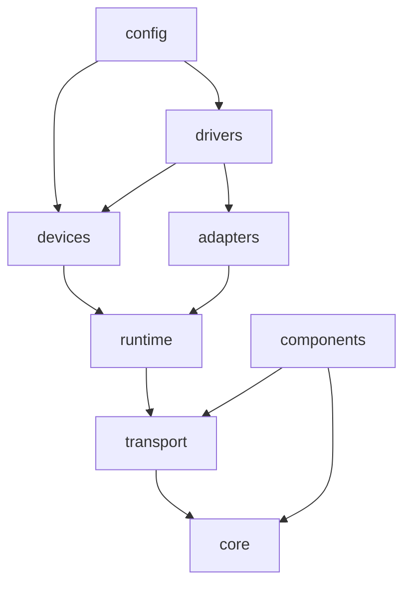

# 包结构与扩展

RSim 按依赖方向和职责组织为八个包。`core` 提供稳定契约，执行、传输、设备接入和业务算法分别实现这些契约。目录分层不增加新的运行时实体：组合仍使用 Component / Signal / CommandSink，扩展仍使用普通 Python 类与工厂函数。

## 代码归属

```text
rsim/
  __init__.py           按需加载的公共便捷入口
  core/                组件、端口、数据模型、时钟与组合
  runtime/             图执行、进程放置、共享源租约、监督与资源锁
  transport/           DDS 描述信息、命令通道、共享数组与编解码
    backends/          Cyclone DDS / ROS2 实现
  adapters/            协议和外部系统适配
    ros2/              context、启动参数、进程驱动、订阅、消息转换
    ros1.py            SSH / ROS1 兼容协议与底盘端口
    hipnuc.py          串口协议解析与采集
    uvc.py             OpenCV / UVC 采集
  devices/             应用侧设备视图，按设备系列拆分
  drivers/             共享 provider 工厂，按设备系列拆分；含 CLI
  components/          算法与合成数据源
  config/              YAML 读取、安装外参和组合装配
```

| 包 | 负责 | 不负责 |
| --- | --- | --- |
| `core` | Component 的任务与 WatchDog、Signal 历史、CommandSink、Frame、Metronome、组合与时间同步 | 启动进程、ROS、DDS、设备配置 |
| `runtime` | Runtime 图解析和生命周期顺序、placement、worker / supervisor、共享源租约与物理锁 | 设备消息解码和业务算法 |
| `transport` | 描述信息收发、共享存储、命令请求应答、封闭数据 codec | 图放置策略、硬件驱动 |
| `adapters` | 外部协议、采集资源、标准 ROS 消息转换 | 应用侧设备选择、EKF 等算法 |
| `devices` | 不启动驱动的连接视图、设备身份与共享数据约定 | 导入 ROS / 串口驱动或打开物理设备 |
| `drivers` | 参数解析后组合 adapter 与共享源，启动 provider | 算法计算与核心生命周期实现 |
| `components` | 对端口数据进行估计、控制、变换或生成 | 按具体设备类型分支调用底层驱动 |
| `config` | 显式工厂选择、graphmap 外参、嵌套对象复用 | 动态执行 YAML 中的任意模块、打开设备 |

`adapters.ros2` 是通用接入工具；D435 和 RobinW 的参数、topic 路由与源组件分别归 `drivers.realsense` 和 `drivers.seyond`。`devices` 与 `drivers` 的同名工厂分别用于连接和提供数据，延续已有使用方式。`components` 中的控制器接受 Signal / CommandSink，或具有这些端口的对象，不导入具体底盘适配器。

`transport.backends.ros2` 处理本库的 DDS 描述信息；`adapters.ros2` 处理设备侧 ROS 消息。两者使用 ROS2 的目的不同，各自管理上下文，互不依赖。

## 依赖方向

下图箭头表示“依赖”，展示主要路径；底层契约可直接被各层使用。



`core` 只依赖自身与基础 Python/NumPy 能力；`transport` 只向 `core` 依赖；`runtime` 只向 `core` 和 `transport` 依赖。设备适配和工厂不能被这三个包反向导入。`components` 对 `transport` 的依赖只用于合成数据源直接分配共享数组；EKF 和运动控制仅使用核心端口与 graphmap。

`Signal` 通过 Runtime 安装的边界回调处理数据共享，自身不认识 mmap 或 DDS。这使本地执行保持普通对象引用，部署到进程时才安装传输绑定。`Runtime` 从旧的核心模块分离，`Component` 仍保留任务注册和自身生命周期状态，避免为了拆目录再增加调度器接口。

`rsim.__init__` 是应用便捷入口，按访问的名称加载所属包。内部代码直接导入所属包，避免通过根入口反向加载集成层。仅导入 `rsim.core` 不加载 Runtime、驱动或可选依赖；普通公共入口和设备客户端不要求 ROS、串口、OpenCV 或 graphmap。几何、配置和运动功能在显式访问时加载其可选依赖。星号导入保留原有基础导出集合，不自动加载这些可选功能。

## 导入方式

包目录支持相对导入。约定在同一职责包内使用相对路径，跨包使用可辨认的绝对路径：

```python
# rsim/core/component.py 内
from .signal import Signal
from .metronome import Metronome

# rsim/drivers/realsense.py 内
from rsim.core.compose import Bundle
from rsim.adapters.ros2 import Driver, RosSensor
```

应用可以继续 `from rsim import Component, Runtime, D435`，也可以明确使用 `from rsim.core import Component` 和 `from rsim.runtime import Runtime`。`from rsim.drivers import D435` 仍是 provider 工厂。使用 `python -m rsim.drivers ...` 启动 CLI，使用 `await rsim.drivers.serve(sensor)` 在已有事件循环中运行。

独立进程入口归 `runtime`：`worker`、`placement_worker`、`supervisor`、`shared_supervisor`、`store_guard` 和 `exec`。它们由运行时通过 `python -m rsim.runtime.<入口>` 启动。文件不再用前导下划线堆在根目录；这些执行协议仍由运行时内部管理，不是应用 API。

## 新增传感器与算法

1. 已有 ROS2 消息类型可直接组合 `RosSensor` 与 `Driver`。需要新协议时，在 `adapters` 添加协议适配，把结果转换为现有数据类型或明确的普通数据 schema。复杂协议出现多个文件时再升级为子包。
2. 在 `devices/<设备系列>.py` 定义应用侧视图、共享 key 和版本约定；在 `drivers/<设备系列>.py` 实现 provider 工厂，复用 `SharedSensor`、适配器和物理锁。可选第三方依赖在使用时加载。
3. 算法放在 `components`，输入使用 Signal，输出和命令显式声明；计算位置由调用方通过 Runtime placement 决定。纯组合无需再创建一种传感器基类。
4. YAML 组装可用 `load_rig(..., factories={"name": factory})` 注入项目自有工厂；内置设备在 `config.loader` 的显式表中登记。外参属于 `config.geometry`，嵌套复用属于 `config.assembly`。

一个设备系列只有少量逻辑时保留一个文件，不为每个类建包。公共名字通过所属包的 `__init__.py` 导出；跨包共享的辅助函数使用明确名称，私有函数和状态仍可使用下划线。当前规模保持单一发行包，不引入插件发现、服务定位器或额外接口继承树。

## 从平铺模块迁移

根入口 `from rsim import ...`、`rsim.devices`、`rsim.drivers`、`rsim.config` 与 `python -m rsim.drivers` 保持。直接引用旧实现模块的代码需要更新，旧路径不添加转发文件：

| 原路径 | 新路径 |
| --- | --- |
| `rsim.core.Component` / `Metronome` | 仍可从 `rsim.core` 导入 |
| `rsim.core.Runtime` | `rsim.runtime.Runtime` 或 `rsim.Runtime` |
| `rsim.model` / `signal` / `errors` | `rsim.core.model` / `signal` / `errors` |
| `rsim.clocks` / `commands` / `compose` / `sync` | `rsim.core` 下的对应模块 |
| `rsim.host` / `process` / `deployment` | `rsim.runtime` 下的对应模块 |
| `rsim.lifecycle` | `rsim.runtime.locks` |
| `rsim.shared` / `_command_channel` | `rsim.transport.shared` / `commands` |
| `rsim.transport` / `transports` | 公共传输入口仍为 `rsim.transport`；具体实现为 `rsim.transport.backends` |
| `rsim.ros`（通用类与转换） | `rsim.adapters.ros2` |
| `rsim.ros.D435` / `RobinW`（直接源类） | `rsim.drivers.realsense.D435Source` / `rsim.drivers.seyond.RobinWSource` |
| `rsim.remote` / `remote_ros2` | `rsim.adapters.ros1` / `rsim.adapters.ros2.chassis` |
| `rsim.imu` / `imu_ros` / `uvc` | `rsim.adapters.hipnuc` / `rsim.adapters.ros2.imu` / `rsim.adapters.uvc` |
| `rsim.motion` / `odometry` / `synthetic` | `rsim.components` 下的对应模块 |
| `rsim._ros_args` | `rsim.adapters.ros2.arguments` |
| `rsim._device_config` / `_driver_config` | `rsim.devices.realsense` / 对应 `rsim.drivers` 设备模块 |
| `rsim._worker` 等进程入口 | `rsim.runtime.worker` 等同名模块 |

ROS2 IMU 包的 `serial_node` 已指向新适配器入口；已有构建使用文件复制安装时，需重新安装该包的脚本。升级时先退出旧 Runtime / provider，再从新代码重建图；旧 cloudpickle 工厂包含模块路径，不作为持久化兼容格式。DDS 描述信息、共享源身份和外部数据接口保持原有协议。

## 设计依据与验证

分离稳定接口与具体实现参考了 [ROS 2 中间件接口设计](https://design.ros2.org/articles/ros_middleware_interface.html)；将基础库与集成层分开参考了 [Gazebo Sim 架构](https://gazebosim.org/docs/harmonic/architecture/)。这里采用其职责分离思路，保留 RSim 现有的协程组件模型，不引入 Gazebo 的 ECS 或插件实体。

`tests/test_architecture.py` 检查包间导入方向、核心包隔离、可选依赖缺失时的公共入口及 CLI。现有运行时、跨进程、共享内存、父进程死亡清理、设备参数、串口与 ROS2 适配测试继续验证行为。包发现由 setuptools 递归处理，新增子包必须带 `__init__.py`；发布前应从构建后的 wheel 验证进程入口，防止源码工作区掩盖漏装模块。
