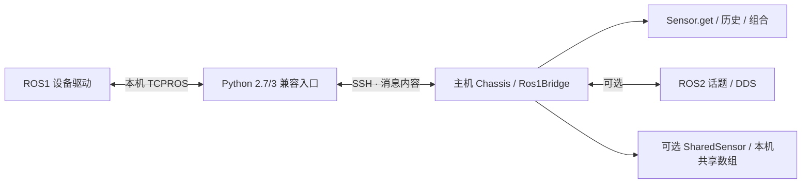

# ROS1 底盘与跨机器通信

`Chassis` 将远端 IMU、里程计、2D 雷达组合成 Sensor，并提供异步速度发送接口。远端保留原有 ROS1 驱动；主机可以使用 ROS-free Python 环境，也可以选择将数据发布为标准 ROS2 话题。



跨机器通道传输消息内容，不转发另一台机器上的 mmap 路径。数值数组使用小端二进制 + base64，保留 dtype、`Inf` 和 `NaN`；主机解码为只读 NumPy 数组。包装进 `ProcessSensor` / `SharedSensor` 后，继续使用本机 DDS 描述信息和共享内存。网络段需要序列化和复制，不属于零拷贝。

## 准备远端

远端只需要能导入 `rospy`、`roslib`、`genpy` 和对应消息包的解释器。这些库由 ROS1 提供；兼容入口支持 Python 2.7 和 Python 3，不依赖主机 RSim 包、NumPy、conda 或 ROS2。若系统解释器已与 ROS1 匹配，直接使用它。

将仓库的独立脚本复制到远端可写目录。例如配置 `ROBOT_HOST`、`REMOTE_DIR` 后：

```bash
ssh "$ROBOT_HOST" "mkdir -p '$REMOTE_DIR/compat'"
scp compat/ros1_agent.py "$ROBOT_HOST:$REMOTE_DIR/compat/ros1_agent.py"
```

现有 ROS master 和设备驱动应先启动。兼容层只连接它们，不启动或重启底盘驱动，不改 ROS master，也不需要开放新 TCP 服务端口。SSH 使用已有的密钥与 known_hosts，适用于已有 SSH 别名。

## 库式调用

下面的变量由调用方配置提供，路径均指远端机器：

```python
from rsim import Chassis, Runtime, SSHConfig

connection = SSHConfig(
    host=robot_host,
    remote_script=remote_agent_path,
    python=remote_python,
    setup=(ros_setup_path, workspace_setup_path),
    master_uri=ros_master_uri,
    ros_ip=robot_ip,
)
chassis = Chassis(
    connection,
    imu_topic=imu_topic,
    odom_topic=odom_topic,
    scan_topic=scan_topic,
    cmd_vel_topic=cmd_vel_topic,
    log_path="assets/chassis-agent.log",
)

async with Runtime(chassis):
    imu = await chassis.imu.get(timeout=10)
    odom = await chassis.odom.get(timeout=10)
    scan = await chassis.scan.get(timeout=10)
    ranges = scan.data["ranges"]
    orientation = imu.data["orientation"]
    pose = odom.data["pose"]["pose"]
    same = await chassis.scan.get(timestamp_ns=scan.stamp_ns, clock=scan.clock)
    acknowledgement = await chassis.stop()  # 全部六个速度分量为零
```

`get()` 返回统一的 Frame，data 是普通字典及只读数组，不包含 ROS message 实例。ROS 原始字段保留在字典内；源时间戳以整数纳秒保存，时间域为 `ros1:<SSH host>`，`received_ns` 使用主机接收时间。源机器和主机的时钟并未自动同步，不能直接相减当作传输时延。

`await chassis.get()` 返回三路最新样本组成的 Bundle，不保证时间对齐；只读单个设备时也可独立使用下面的 topic 工厂，避免等待其他设备的首帧。

```python
from rsim import Ros1Bridge, Runtime

bridge = Ros1Bridge(connection)
sensor = bridge.topic(topic_name, message_type, hz=50, history=64)
async with Runtime(sensor):
    frame = await sensor.get(timeout=10)
    available = await sensor.bridge.topics()
    # type 可为远端安装的任意 ROS1 消息，例如厂商电池、超声或状态消息。
```

订阅省略 message_type 时从现有已发布话题推断。发布使用 `await bridge.publish_message(topic, message_type, data)`，data 是 ROS 字段字典；未知字段、类型错误、无订阅者会报错。发布端消息值目前使用 JSON 标量、字典和列表，读取端的 NumPy 数组需要先转成列表。

相同 SSH 配置、topic、速率和 history 在同一个 Runtime 内复用连接及订阅。组合后的 `sensor.bridge`、`chassis.bridge` 指向实际活动的连接。不同进程希望共用一份采集时，在主机用 `SharedSensor(lambda: Chassis(connection, ...), key=..., version=...)` 显式建立共享源；将完整连接及 topic 配置计入 version。共享源的帧包含全部字段，跨进程命令 RPC 仍需使用独立控制端或下方 ROS2 入口。

## ROS2 / DDS 双向话题

主机具备 ROS2 时可添加镜像层：

```python
from rsim import Runtime
from rsim.remote_ros2 import ChassisROS2

relay = ChassisROS2(chassis, prefix="/chassis")
async with Runtime(relay):
    frame = await chassis.scan.get(timeout=10)
    # 保持此 Runtime 活动期间，其他 ROS2 节点可订阅/发布下表话题。
```

| 主机 ROS2 话题 | 类型 | 方向 |
| --- | --- | --- |
| `/chassis/imu` | `sensor_msgs/msg/Imu` | ROS1 → ROS2 |
| `/chassis/odom` | `nav_msgs/msg/Odometry` | ROS1 → ROS2 |
| `/chassis/scan` | `sensor_msgs/msg/LaserScan` | ROS1 → ROS2 |
| `/chassis/cmd_vel` | `geometry_msgs/msg/Twist` | ROS2 → ROS1 配置的 cmd_vel topic |

镜像层转换 ROS1/ROS2 的 Header 和 time 字段差异，保留 frame_id、源时间戳、协方差和扫描值。传感器采用 sensor-data QoS（best effort），命令采用 reliable、volatile、depth=1。ROS2 消费者应选择兼容 QoS 和同一个 domain。

可运行的 [命令行示例](../examples/chassis.py) 支持 `--host`、重复的 `--setup`、topic 映射、`--ros2 PREFIX`、`--serve` 和 `--stop-test`。默认仅采集；`--stop-test` 明确发送一次全零 Twist：

```bash
python -m examples.chassis --host "$ROBOT_HOST" \
  --remote-script "$REMOTE_AGENT" --python "$REMOTE_PYTHON" \
  --setup "$ROS_SETUP" --setup "$WORKSPACE_SETUP" \
  --ros-ip "$ROBOT_IP" --odom "$ODOM_TOPIC" --cmd-vel "$CMD_VEL_TOPIC" \
  --ros2 /chassis --serve
```

## 生命周期与控制语义

所有主机收发、心跳、转换、命令服务任务由 Runtime / Metronome / WatchDog 管理。远端 rospy 回调只保留每话题最新样本，主机也使用有界队列；这是最新帧接口，不保证无损录像。现有 Sensor 的 `hz` / `history` 语义保持不变。

退出 Runtime 会关闭 SSH 标准输入，使远端取消订阅并释放其发布者。主进程异常退出时，本机 SSH 子进程受 parent-death 保护；远端还有 10 秒心跳期限。ROS master 不可用时，启动阶段有 15 秒期限，客户端提前离开也会退出。连接故障会传播到等待中的请求和 `get()`，不会无限返回旧帧；重新进入 Runtime 建立新会话，不自动重放控制消息。

速度通过 `set_velocity(linear, angular)` 发送，分别为前向 m/s、绕 z 轴 rad/s；默认均为零。所有 `geometry_msgs/Twist` 发布均不 latch，远端在最后一次命令后 0.5 秒或连接关闭时发送零速。持续控制需要持续刷新；软件发送零速不等于已确认电机制动。

发布应答表示 ROS1 已有订阅连接、消息通过校验并交给 rospy。它不代表某个特定订阅者执行完成。验证真实到达时，应使用底盘侧独立订阅者，并核对发布节点身份；仅收到本地应答不能当作执行证明。

选型参考：[ROS1 bridge 的发行版约束](https://index.ros.org/p/ros1_bridge/)、[rosbridge 的跨语言消息接口](https://github.com/RobotWebTools/rosbridge_suite)。本实现使用小型、版本化的 SSH 消息协议，不要求同时安装 ROS1/ROS2，也不声称兼容完整 rosbridge WebSocket 协议；当前提供 topic 查询、订阅和发布，不转发 service/action。
